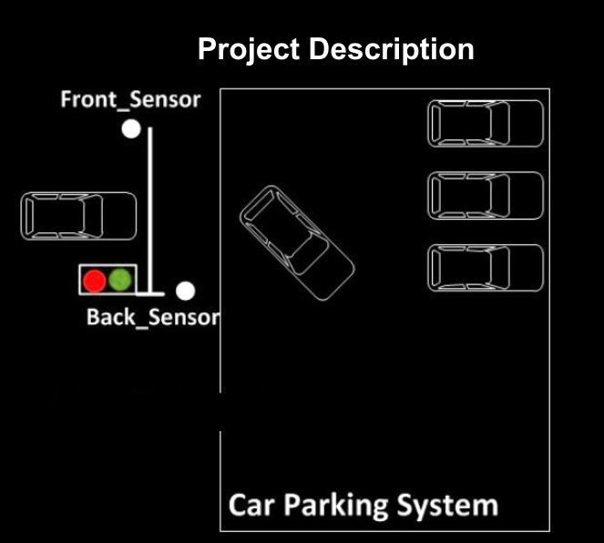
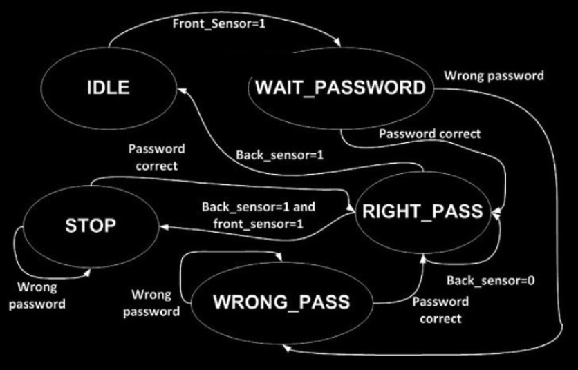

# Car Parking System
Car Parking System finite state machine (FSM) implemented in VHDL. FPGA course project.

----

The Parking System is models using the following FSM (finite state machines):

----

### Files
- `code` directory contains VHDL codes.
- `report` -> Report of the project. It contains full description of the probelm and the codes.